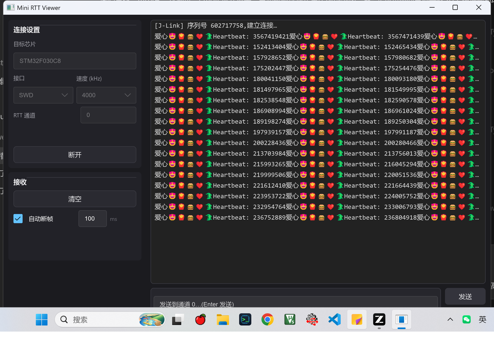

# Mini RTT Viewer

轻量级 SEGGER RTT 日志查看器 —— 为 **UTF-8 / emoji** 而生。



## 为什么做这个

官方 J-Link RTT Viewer 对 UTF-8 的支持是坏的:中文乱码、emoji 直接丢失。这个项目用 Rust + Slint 重写了核心的"连接 + 看日志 + 发数据"体验:

- **单文件 exe,约 4 MB**,无需安装,拷给同事就能用
- **启动 < 100ms**,没有 Python 运行时、没有 WebView
- **UTF-8 完整支持**,中文 / emoji 原样显示,跨读取块的多字节序列自动拼接
- **高吞吐不卡 UI**:行式虚拟化渲染,只画可见行;实测长时间流式输出 CPU 占用 < 1% 单核
- 无换行符的裸流(如裸 printf 数值)可开启**自动断帧**(静默超时切行),超时可调

## 功能

- 连接设置:目标芯片型号 / SWD / JTAG / 速率 (100–12000 kHz) / RTT 通道 0–15
- 接收:ANSI 转义序列剥离、自动滚动(上翻时不再被拉回底部)、自动断帧 + 超时
- 发送:向所选下行通道发送数据,Enter 快捷发送(自动追加 `\r\n`)
- 暗色主题,键盘可完整操作(Tab 导航 / Enter / Space)

## 使用前提

- Windows 10/11 x64
- 已安装 [SEGGER J-Link 软件包](https://www.segger.com/downloads/jlink/)(程序运行时加载 `JLink_x64.dll`)
- J-Link 调试器 + 目标板固件已初始化 SEGGER RTT(`SEGGER_RTT` 组件)

芯片型号需填写 J-Link 支持的完整型号名(如 `STM32F030C8`、`STM32H750VB`),与官方 RTT Viewer 中的写法一致。

## 构建

```bat
cargo build --release
build_release.bat   :: 构建 + 可选 UPX 压缩 + 输出到 dist\
```

Rust 1.75+。`tools/` 目录放入 UPX(可选)后脚本会自动压缩。

## 发布

推送 tag 自动构建并发布到 GitHub Releases(Windows x64):

```bash
git tag v0.1.0
git push origin v0.1.0
```

CI 配置见 [.github/workflows/release.yml](.github/workflows/release.yml)。

## 技术栈

| 组件 | 选择 | 理由 |
|---|---|---|
| UI | Slint 1.x | 编译期声明式 UI,启动秒开,exe 小 |
| J-Link 访问 | FFI 直调 `JLink_x64.dll` | 与官方工具/驱动共存,不抢 USB(纯 USB 协议实现需要 Zadig 换驱动,会破坏 SEGGER 工具链) |
| 并发模型 | std::thread + mpsc + UI 50ms 合并泵 | 读线程不碰 UI,UI 只消费合并后的行 |

连接时序沿用了经过验证的 J-Link DLL 状态机要求(RTT START 在 connect 之前建立)。

## License

[MIT](LICENSE)
