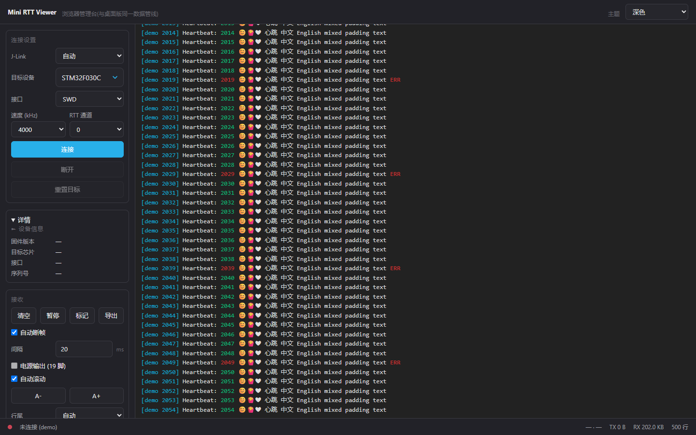

# Mini RTT Viewer

轻量级 SEGGER RTT 日志查看器 —— 为 **UTF-8 / emoji** 而生。

[](https://github.com/MisakaMikoto128/mini-rtt-viewer/actions/workflows/ci.yml)
[](https://github.com/MisakaMikoto128/mini-rtt-viewer/releases/latest)
[](LICENSE)


项目主页:<https://misakamikoto128.github.io/mini-rtt-viewer/>



## 为什么做这个

官方 J-Link RTT Viewer 对 UTF-8 的支持是坏的:中文乱码、emoji 直接丢失。这个项目用 Rust 重写了核心的"连接 + 看日志 + 发数据"体验:

- **单文件 exe,UPX 后约 0.64 MB**:双击 = 启动本机服务 + 自动打开浏览器管理台(<http://127.0.0.1:8686>);没有安装器、没有 Python,界面就跑在你自己的浏览器里
- **UTF-8 完整支持**:中文 / emoji 原样显示,跨读取块的多字节序列自动拼接;另可切 GBK / UTF-16 LE / Latin-1 / ASCII
- **实时流畅**:WS 实时日志流,10kHz+ 吞吐不卡 UI;日志保留最近 500 行,长时间流式输出内存占用恒定
- 无换行符的裸流(如裸 printf 数值)可开启**自动断帧**:相邻数据到达间隔超过设定值自动换行,间隔毫秒级可调、改了立即生效无需重连
- **滚动不拉扯**:上滚即停随,滚回底部自动恢复跟随,新数据不会把你拽离正在看的行

## 功能

- 连接设置:目标芯片型号(内置约 1.2 万设备库,输入即筛选)/ 多台 J-Link 下拉指定 / SWD / JTAG / 速率 (100–12000 kHz) / RTT 通道 0–15 / 电源输出 / 重置目标;连接后固件版本、序列号、核心型号等设备信息直接可读
- 接收:ANSI 16/256/RGB 真彩色解析(颜色状态跨行跨块保持)、暂停 / 清空 / 会话标记、导出 .log、行尾可选(自动 / CRLF / LF / CR / 无)、HEX 接收、字号 A- / A+、自动滚动
- 发送:Enter 快捷发送,行尾可选(CRLF / LF / CR / 无),HEX 发送(`41 42 43` / `0x4142` 按原始字节),定时发送(按设定间隔自动重发)
- VS Code 式搜索:Ctrl+F 浮动条,字面量 / 大小写 / 正则开关,命中计数 n/m,Enter / Shift+Enter 逐处跳转
- 四套主题:深色 / 浅色 / OLED 纯黑 / 护眼暖色,下拉即时切换
- 偏好记忆:连接参数、主题、字号、发送历史等自动落 `%APPDATA%/MiniRttViewer/prefs.json`,启动恢复、变化即存
- 无设备演示:`mini-rtt-viewer.exe --demo-log` 启动内置演示数据流(中英混排 + emoji + 颜色样例),体验滚动 / 断帧 / 渲染

## 快速开始

1. 解压下载的 zip
2. 双击 `mini-rtt-viewer.exe` —— 本机服务随即启动,浏览器自动打开管理台 `http://127.0.0.1:8686`
3. 填芯片型号(如 `STM32F103C8`),点「连接」开始收日志;手边没板子就先跑 `--demo-log`

命令行参数(`--help` 同):

```text
mini-rtt-viewer [选项]
  --demo-log    使用内置演示数据源,无需 J-Link 设备即可体验/测试
  --port <n>    HTTP 监听端口(默认 8686,仅绑定 127.0.0.1)
  --no-open     不自动打开浏览器(仅启动服务)
  -h, --help    显示本帮助并退出

环境变量:RTT_WEB_NO_BROWSER=1 同样跳过自动打开浏览器(无头/测试场景)
端口被占 = 已有实例在运行(端口互斥)
```

## 使用前提

- Windows 10/11 x64
- 任意现代浏览器(管理台界面)
- 已安装 [SEGGER J-Link 软件包](https://www.segger.com/downloads/jlink/)(程序运行时加载其中的 `JLinkARM.dll`;本工具不捆绑、不分发该 DLL)
- J-Link 调试器 + 目标板固件已初始化 SEGGER RTT(`SEGGER_RTT` 组件)

芯片型号需填写 J-Link 支持的完整型号名(如 `STM32F030C8`、`STM32H750VB`),与官方 RTT Viewer 中的写法一致。

## 构建

```bat
cargo build --release
cargo test                    :: 数据层纯逻辑单元测试
build_release.bat   :: 构建 + 可选 UPX 压缩 + 输出到 dist\
```

Rust 1.75+。`tools/` 目录放入 UPX(可选)后脚本会自动压缩。提交前跑 `cargo clippy --all-targets`。

## 发布

推送 tag 自动构建并发布到 GitHub Releases(Windows x64):

```bash
git tag v0.3.0
git push origin v0.3.0
```

CI 配置见 [.github/workflows/release.yml](.github/workflows/release.yml)。

## 技术栈

| 组件 | 选择 | 理由 |
|---|---|---|
| 界面 | 内嵌 Web 管理台,浏览器即界面 | exe 只做本机服务(仅绑定 127.0.0.1),不捆绑任何 UI 运行时,UPX 后 0.64 MB;SerialHub 同构 |
| 服务层 | axum + tokio(REST / WS API) | 管理台单页 + API 契约,前端 / 服务端 / 黑盒测试三方对齐 |
| J-Link 访问 | FFI 直调 `JLinkARM.dll`(libloading) | 与官方工具/驱动共存,不抢 USB(纯 USB 协议实现需要 Zadig 换驱动,会破坏 SEGGER 工具链) |
| 数据层 | vte + encoding_rs + unicode-width + regex-lite | ANSI 解析 / 字符集增量解码 / 显示列宽 / 正则搜索,与 UI 形态无关,单元测试覆盖 |
| 并发模型 | worker 读线程(std::thread + mpsc)→ 纯逻辑泵 → 服务层分发 | 读线程不碰界面;断行 / ANSI / 裁剪在纯逻辑泵完成,UI 只消费结果 |

连接时序沿用了经过验证的 J-Link DLL 状态机要求(RTT START 在 connect 之前建立)。

## 代码结构

| 文件 | 职责 |
|---|---|
| `src/lib.rs` | 模块树唯一入口;bin/examples 一律 `use` 本 crate |
| `src/main.rs` | 薄启动层:解析 `--help / --demo-log / --port / --no-open` 后交给 `web::run`,不放业务分支 |
| `src/web.rs` | 浏览器管理台服务:单页 + REST/WS API(API 契约注释即文档,改这里必同步前端与测试) |
| `src/rtt.rs` | worker 读线程:连接序列 + 读循环(断帧判定 / 命令消化 / UTF-8 增量解码) |
| `src/jlink_dll.rs` | JLinkARM.dll 最小 FFI 绑定(连接 / RTT / 设备信息 / 调试器枚举与选定) |
| `src/device_db.rs` | 设备库后台枚举 + 磁盘缓存 + 多台调试器列表 |
| `src/log_model.rs` | 消息泵纯逻辑(断行 / 缓冲 / ANSI 带色行 / 500 行上限),有单元测试 |
| `src/ansi.rs` | ANSI 转义 → 带色文本段(vte 状态机,颜色状态跨行跨块保持),有单元测试 |
| `src/config.rs` | 偏好持久化(`%APPDATA%/MiniRttViewer/prefs.json`:serde 默认值兜底 + 原子写) |
| `src/demo.rs` | `--demo-log` 演示数据源(中英混排 + emoji + ANSI 颜色样例) |
| `src/single_instance.rs` | 旧单实例互斥(0.3.0 起由端口互斥替代,已无调用方,保留待清理) |
| `ui/web/index.html` | 管理台前端单页(`include_str!` 编译期内嵌进 exe,含 favicon) |
| `examples/emu_check.rs` | 无界面验证:枚举调试器 + 选定/实际打开一致性 |
| `examples/rtt_check.rs` | 无界面 RTT 直读(连接序列排障用) |
| `AGENTS.md` | 实际踩坑经验笔记(改代码前先读) |

## License

[MIT](LICENSE)
